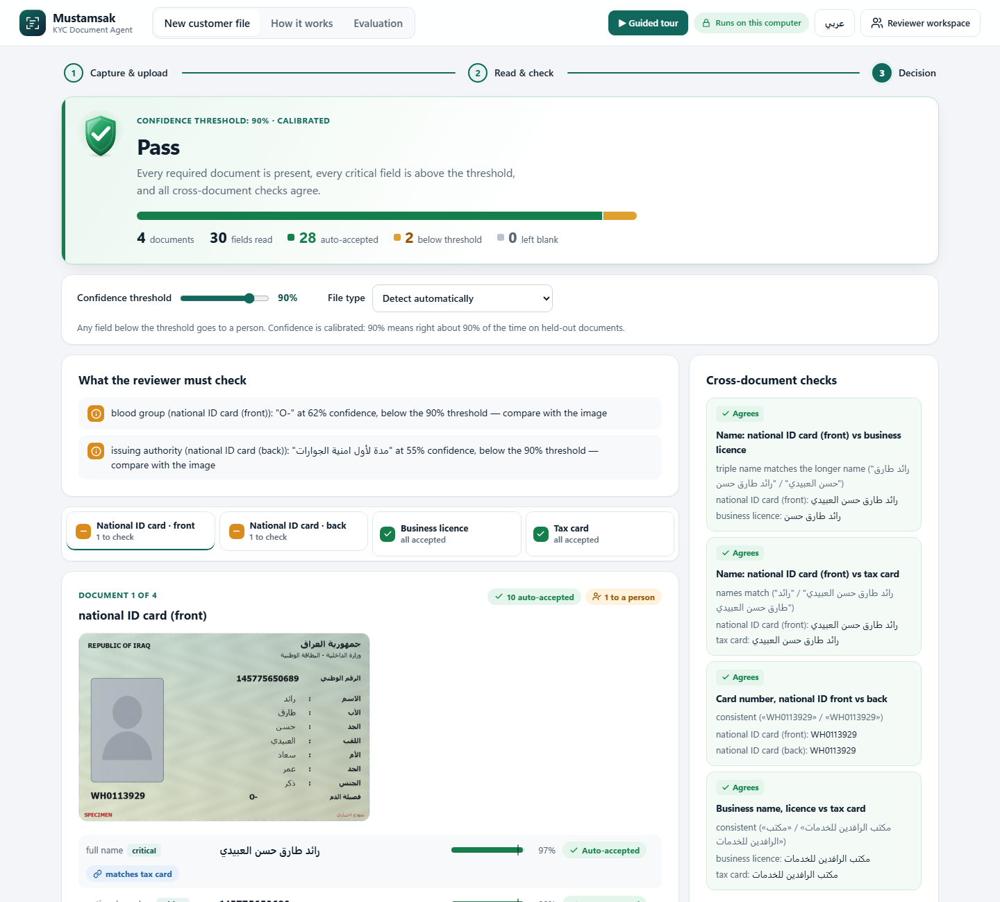
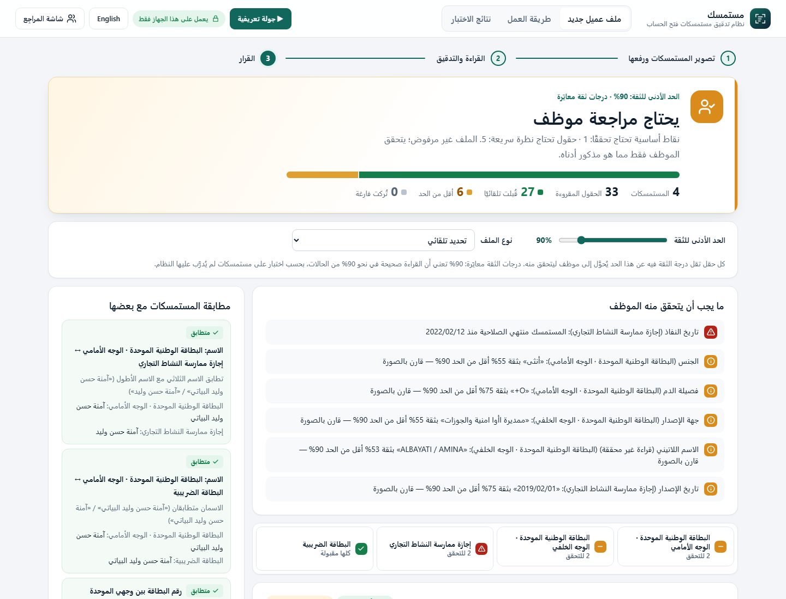
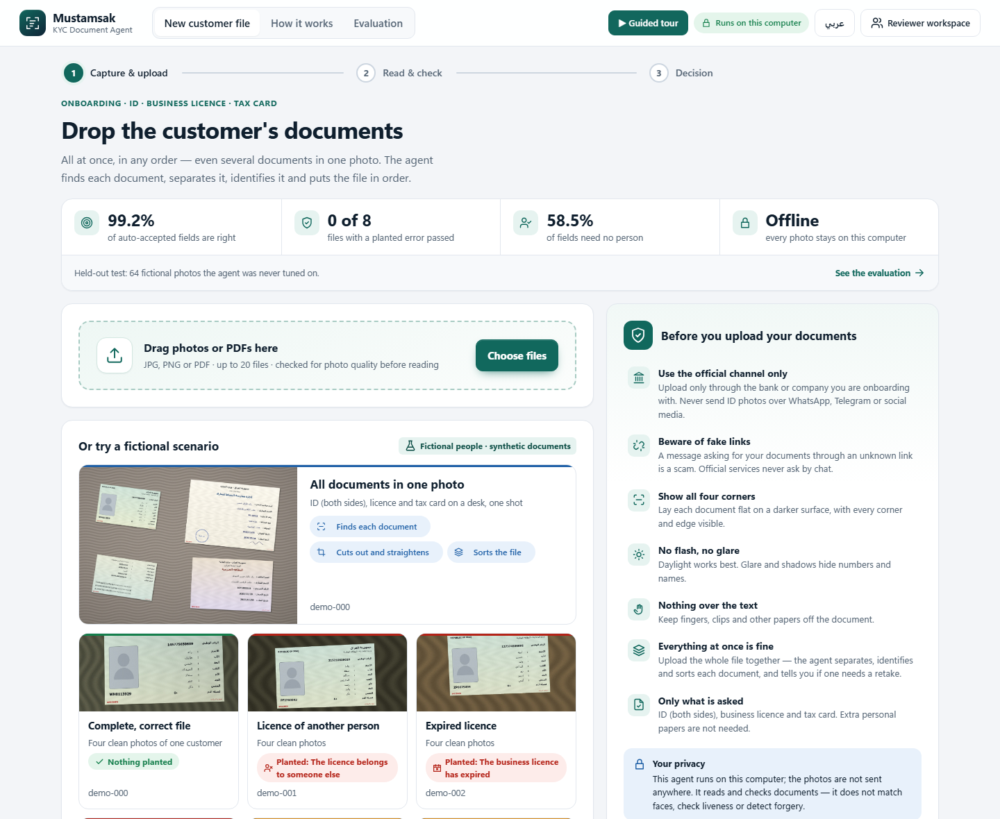
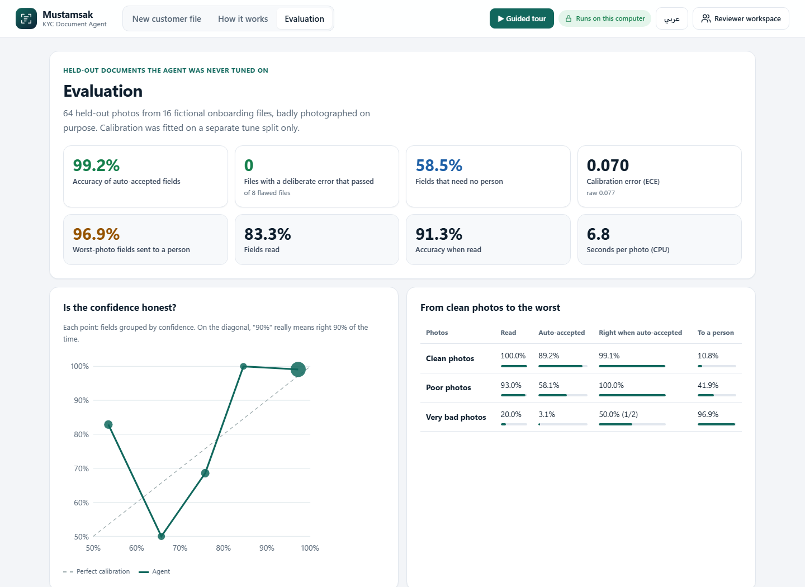
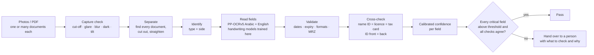

<div align="center">

# Mustamsak · مستمسك

### KYC Document Agent: reads the documents, checks them against each other, and knows when to hand over to a person

**English** · [العربية](#العربية)




</div>

---

## In one minute

Opening a bank account or registering a merchant in Iraq needs photos of a **national ID (both sides), a
business licence and a tax card**. Reviewers check them by hand, which is slow and inconsistent. The photos
are often blurry, tilted or partly covered. The documents are in Arabic script, and some carry
handwriting.

**Mustamsak** takes those photos and:

1. **checks photo quality** before reading ("the corner is cut off, retake the photo");
2. **finds and separates every document**, even when the customer uploads everything **in one photo**,
   then straightens it, identifies it (ID front/back, licence, tax card) and **puts the file in order**;
3. **reads every field**: Arabic, English, and handwritten Arabic-Indic digits;
4. **validates** dates, expiry, formats and MRZ check digits;
5. **cross-checks the documents**: the name on the ID must match the licence owner and the taxpayer, the ID
   front and back must belong to the same card, the business names must agree;
6. gives **every field a calibrated confidence**, where 90% means right about 90% of the time;
7. **passes the file**, or **hands it over to a person** with a short list of exactly what to check and why.

It **never fills in a field it could not read**: blank and flagged beats invented. It runs **entirely on
your computer**, and every document in this repository is **fictional**.

## Contents

- [Screenshots](#screenshots)
- [A 3-minute demo for judges](#a-3-minute-demo-for-judges)
- [Install and run on your PC](#install-and-run-on-your-pc)
- [How it works](#how-it-works)
- [How it meets the brief](#how-it-meets-the-brief)
- [Results](#results-held-out-never-tuned-on)
- [Data and privacy](#data-and-privacy)
- [Project structure](#project-structure)
- [Development](#development)
- [العربية](#العربية)

## Screenshots

| **Passed on its own:** a complete, correct file | **Handed to a person:** an expired licence, in Arabic (RTL) |
|---|---|
|  |  |
| **Upload:** live held-out results, six demo scenarios, safe-sharing guidance | **Evaluation:** held-out accuracy and calibration |
|  |  |

The upload screen in Arabic: [docs/screenshots/03-upload-ar.png](docs/screenshots/03-upload-ar.png). The
interface's design system (tokens, components, accessibility checks) is in [docs/DESIGN.md](docs/DESIGN.md).

## A 3-minute demo for judges

Start the app (see [Install and run](#install-and-run-on-your-pc)). It opens at **http://127.0.0.1:8766**.

> **Fastest way:** click **▶ Guided tour** (top right). You only press **Next**. The tour drives the app
> through one fictional file, from upload to the reviewer who receives the data, in 22 steps. It dims the
> screen around the part it explains, and it works in English and Arabic.
> To open a single step directly, use `http://127.0.0.1:8766/?tour=12`.

Or explore it yourself:

1. **Before you upload.** The panel on the right teaches safe sharing: official channels only, fake-link
   warnings, four corners visible, no glare.
2. Click **Complete, correct file**. Four clean photos of one fictional customer: the agent reads them,
   cross-checks them and **passes the file on its own**, listing only optional notes for the reviewer.
3. Click **All documents in one photo**. One desk photo holds the ID (both sides), licence and tax card.
   Watch the agent separate them, then show them sorted: ID front → ID back → licence → tax card.
4. On the **decision** screen:
   - drag the **confidence threshold**: fields cross the line and the decision updates live;
   - click any item under **What the reviewer must check**: it jumps to that field;
   - look at the **cross-document checks** and the **note for the reviewer** (English and Arabic);
   - **print the sorted file** (PDF) or **download the decision report** (JSON).
5. Try **File with a deliberate error**. The licence belongs to someone else, and the agent blocks the file
   for exactly that reason. (The demo split also holds an expired licence and an ID back from another card.)
6. Try **Very bad photos** (dark, shaky, a thumb over the text). Almost everything goes to a person, which
   is exactly what should happen.
7. Upload any photo with **Choose files**. Bad photos get retake advice **before** anything is read.
8. Open **Evaluation** for held-out accuracy and the calibration curve, and **عربي** for the Arabic interface.
9. **Reviewer workspace** (top right) is the full workbench: edit fields, re-crop, pair ID sides, print
   layouts, and a training dashboard for the handwriting models.

## Install and run on your PC

### Requirements

| | |
|---|---|
| OS | **Windows 10 or 11** (tested). See [other systems](#other-systems) |
| Python | **3.12, 64-bit**, from [python.org](https://www.python.org/downloads/). Tick "Add python.exe to PATH" |
| Disk / RAM | about 3 GB free, 8 GB RAM |
| Internet | only for the one-time setup (packages and public OCR models). The app itself runs offline |

### 1 · Get the code

```powershell
git clone https://github.com/hasanwadhah/mustamsak-kyc-agent.git
cd mustamsak-kyc-agent
```

(or **Code → Download ZIP** on GitHub, then unzip)

### 2 · Set up once (10–20 minutes)

```powershell
powershell -ExecutionPolicy Bypass -File setup.ps1
```

This creates `.venv`, installs the CPU-only packages (about 1.5 GB) and downloads the public OCR models.
The handwriting models trained for this project are already in `models/`.

### 3 · Start and stop

Double-click **`Start KYC Agent.cmd`**. The browser opens at **http://127.0.0.1:8766**.
Double-click **`Stop KYC Agent.cmd`** to stop it. Closing the browser does not stop the server.

**Updates.** If you installed with `git clone`, `Start KYC Agent.cmd` first checks GitHub and brings the folder
up to the newest version. It only updates when that is safe:

- it only fast-forwards;
- it never overwrites a file you edited, or a commit that is not on GitHub;
- when you are offline, it simply starts the version you have.

The bottom of the screen shows the running version and whether it is up to date. If you downloaded a ZIP,
download it again to update. To skip the check: `powershell -ExecutionPolicy Bypass -File start.ps1 -NoUpdate`.

```powershell
powershell -ExecutionPolicy Bypass -File start.ps1         # start
powershell -ExecutionPolicy Bypass -File start.ps1 -Stop   # stop
```

The first reading after a start takes a few extra seconds while the models load. After that it takes
about 5 s per photo on a laptop CPU.

### Troubleshooting

| Problem | Fix |
|---|---|
| `Python 3.12 is required` | Install Python 3.12 (64-bit) from python.org, then run `setup.ps1` again |
| "running scripts is disabled" | Use the `powershell -ExecutionPolicy Bypass -File …` commands above |
| Port 8766 is in use | `start.ps1 -Port 8800`, then open http://127.0.0.1:8800 |
| Setup stopped halfway (network) | Run `setup.ps1` again; installed packages are reused |

### Other systems

The launcher scripts are for Windows. On Linux the app should run with the manual steps below
(**untested**). On macOS, the pinned `+cpu` PyTorch wheels are not available, so use `requirements.txt`
instead (also untested).

```bash
python3.12 -m venv .venv && source .venv/bin/activate
pip install -r requirements-lock.txt --extra-index-url https://download.pytorch.org/whl/cpu
python scripts/setup_models.py && python scripts/setup_english.py && python scripts/setup_arabic_v5.py
python -m uvicorn app.main:app --host 127.0.0.1 --port 8766
```

## How it works



**How a confidence becomes a decision**

1. **Own evidence.** The OCR score is capped by how the field was read (read · uncertain · approximate ·
   conflict), capped by plausibility (a one-digit date part, Latin letters inside an Arabic name), and
   lowered by photo problems.
2. **Corroboration.** The same value read independently on two documents (e.g. the ID and the tax card)
   combines as independent evidence. MRZ check digits and paired card serials count as proof.
3. **Calibration.** A monotone (isotonic) curve fitted on the tune split only, so 0.9 means right about 90%
   of the time.
4. **Threshold.** The file goes to a person if any of these holds:
   - a critical field is below the threshold (default 0.90) or blank;
   - a validation or cross-check failed;
   - a required document is missing.

   Otherwise it **passes**.

More detail: [docs/ARCHITECTURE.md](docs/ARCHITECTURE.md) · handwriting models:
[docs/HANDWRITING.md](docs/HANDWRITING.md).

## How it meets the brief

| Requirement | Where it lives |
|---|---|
| A confidence for **every** field + a threshold below which it goes to a human | `app/kyc.py`: raw → corroborated → calibrated confidence. Threshold 0.90, adjustable live on the decision screen |
| Cross-document checks | `kyc.cross_checks`: name (ID ↔ licence ↔ tax card), card number (front ↔ back), birth date, national number, business name |
| **Never** fills in a field it could not read | Enforced and tested: `kyc.py` is read-only; tolerant matching locates labels, never values |
| A clear exception path with a human-readable summary | The reasons list (linked to each field) and the reviewer note, in English and Arabic |
| Extraction accuracy on a held-out set | `scripts/evaluate_kyc.py --split heldout` → `eval/reports/kyc-heldout.md` |
| Calibrated confidence | Isotonic calibration fitted on the tune split, reported on held-out (ECE 0.070). Independent evidence (check digits, a second OCR engine, a second document) lifts confidence; it never changes a value |
| Sensible behaviour on the worst photos | 96.9% of worst-photo fields go to a person. 0 files with a planted problem pass |
| **Stretch:** capture-time guidance | `app/capture.py` + `POST /api/capture-check`: which corner is cut off, where the glare is, blur, darkness, tilt |
| Out of scope | Face matching, liveness and forgery detection are intentionally absent |

**Beyond the brief**

- **Upload everything at once.** Several documents in one photo are separated and sorted automatically.
- **Awareness before upload.** Safe-sharing guidance for customers, in both languages.
- **Print.** The sorted file as a PDF, with the ID front and back together.
- **Bilingual interface.** English and Arabic, with full right-to-left layout.
- **Handwriting.** Handwritten Arabic-Indic digits are read by two small models trained in this project,
  including a segmentation-free CNN + CTC number reader
  ([docs/HANDWRITING.md](docs/HANDWRITING.md)).

## Results (held-out, never tuned on)

64 photos of 16 fictional onboarding files. 8 of the files carry a **deliberate error**: another person's
licence, an expired licence, or an ID back from another card. Photo quality: 30% clean, 40% poor, 30% very
bad (angle, perspective, dim or dark light, glare, a thumb or paper over the text, cut-off corners, blur,
noise, JPEG). Threshold 0.90.

| Measure | Result |
|---|---|
| **Accuracy of auto-accepted fields** | **99.2%** (critical fields 98.4%) |
| **Files with a deliberate error that passed** | **0 of 8** |
| **Passed files with a wrong critical field** | **0** |
| Fields auto-accepted (no person needed) | **58.5%** of all fields |
| Calibration error (ECE) | 0.077 uncalibrated → **0.070** calibrated |
| Very bad photos: fields sent to a person | 96.9% |
| Fields read / accuracy when read | 83.2% / 91.3% |
| Fields auto-accepted: clean · poor · very bad photos | 89.2% · 58.1% · 3.1% |
| Deliberate error named in the reviewer note | 75% (otherwise the key field was unreadable and flagged) |
| Retake asked: clean · poor · very bad photos | 0% · 28.6% · 55.6% |
| Document type and side correct | 87.5% |
| Speed | about 7 s per photo on a laptop CPU |

Fields scored 0.9–1.0 (mean 0.972) were right **99.1%** of the time (n = 234). Full report:
[eval/reports/kyc-heldout.md](eval/reports/kyc-heldout.md).

**What changed in the last round.** Clean fields were being sent to people for no good reason, so the
agent now uses more independent evidence. It never changes a value.

- A **second OCR engine** re-reads names, numbers and dates. Exact agreement counts: on tune, 89 of 89
  agreeing fields were right.
- A date that matches the **MRZ check digit** now counts as confirmed.
- **Rows the page scan cut short** are re-read whole.
- A **name confirmed by another document** also confirms the matching parts of the ID name.

Result on held-out: auto-accepted fields went from 41.8% to 58.5%, and their accuracy went from 98.8% to
99.2%, with still 0 false passes.

**Known limitations**

- **On held-out, no error-free file passed automatically yet (0 of 8).** Each one had a very bad photo, a
  poor photo of a critical field, or a handwritten licence name, so a person saw it. Clean files do pass:
  try **Complete, correct file** in the demo.
- **Handwritten licence owner names** (a Diwani-style script) cause most misreadings. They are routed to a
  person.
- Calibration error rose from 0.055 to 0.070 with the new evidence. The top bin is well calibrated (97.2%
  stated, 99.1% observed), but the lower bins hold 12–35 fields each and are noisy.
- On very bad photos only 20% of fields are read. 2 fields were auto-accepted there, and 1 was wrong.
- **Glare** is detected in only 36% of the photos that have it.
- The synthetic templates follow real layouts, but real documents vary more.

## Data and privacy

- **Only fictional documents.** `scripts/synthetic_kyc.py` invents every name, number and business. Every
  template is stamped **SPECIMEN / نموذج**, and every label file says `"fictional": true`. Demo files are a
  separate split, never used for scoring.
- **No real identity documents anywhere, including in the models.** The digit CNN is trained on
  [MADBase](https://huggingface.co/datasets/MagedSaeed/MADBase) public handwriting plus synthetic strokes. The
  number reader is trained on synthetic strips only.
- **Check it yourself:** `python scripts/check_no_real_data.py` lists every image and the training data
  of every model, and fails if anything real is found.
- **Local only.** Photos are processed on your computer and not sent anywhere. The server listens on
  127.0.0.1 only, with an Origin check and a strict Content-Security-Policy.
- **Optional cloud reader (Google Gemini).** It is **off** by default, needs your own key and your consent
  for each image, and only ever suggests values. See [docs/EXTERNAL_API.md](docs/EXTERNAL_API.md).

## Project structure

```
app/                  FastAPI server, reading pipeline, KYC decision layer
  main.py             HTTP API (127.0.0.1 only), batches, export/print
  agent_api.py        demo files + evaluation report for the agent screen
  pipeline.py         decode → separate → capture check → OCR → classify → fields
  vision.py           document detection (several per photo), geometry, classification
  capture.py          photo-quality checks and retake advice
  arabic_ocr.py       PP-OCRv5 (Arabic + English) via RapidOCR / ONNX
  kyc.py              confidence, calibration, validation, cross-checks, decision, summary
  handwritten_digits.py · number_reader.py   handwriting models (numpy inference)
static/               agent screen (agent.html/js/css, EN + AR) and the reviewer workspace
scripts/              synthetic data, evaluation, training, setup, data audit
eval/synthetic/       fictional documents: tune / heldout / demo splits with labels
eval/reports/         evaluation reports (Markdown + JSON)
models/               calibration + handwriting models trained in this project
tests/                297 automated tests (pytest)
docs/                 architecture, handwriting models, optional cloud reader, screenshots
```

## Development

```powershell
.\.venv\Scripts\python.exe -m pytest -q                              # 297 tests
.\.venv\Scripts\python.exe scripts\check_no_real_data.py             # data audit

# regenerate the fictional data and re-run the evaluation
.\.venv\Scripts\python.exe scripts\synthetic_kyc.py --split tune --cases 16
.\.venv\Scripts\python.exe scripts\synthetic_kyc.py --split heldout --cases 16
.\.venv\Scripts\python.exe scripts\evaluate_kyc.py --split tune --fit     # calibration: tune only
.\.venv\Scripts\python.exe scripts\evaluate_kyc.py --split heldout        # report only
.\.venv\Scripts\python.exe scripts\synthetic_kyc.py --split demo --clean-copies     # six scripted stories
.\.venv\Scripts\python.exe scripts\demo_pile.py                           # "all in one photo" demos
```

**Tech stack:** Python 3.12 · FastAPI · OpenCV · PP-OCRv5 (RapidOCR/ONNX Runtime) · EasyOCR · NumPy ·
PyTorch (training only) · plain HTML/CSS/JS, with no CDNs and no build step.

**Acknowledgements:** PP-OCRv5 (PaddleOCR) via RapidOCR · EasyOCR · MADBase (El-Sherif & Abdelazeem, 2007),
used for research with citation.

---

<div dir="rtl" align="right">

## العربية

### مستمسك: نظام تدقيق مستمسكات فتح الحساب

**يقرأ المستمسكات، ويطابقها مع بعضها، ويعرف متى يحوّل الملف إلى موظف.**

#### الفكرة باختصار

فتح حساب مصرفي أو تسجيل تاجر يحتاج صور **البطاقة الوطنية بوجهيها، وإجازة ممارسة النشاط التجاري،
والبطاقة الضريبية**. يدقق الموظفون هذه الصور يدويًا، وهذا بطيء وغير متّسق. والصور كثيرًا ما تكون مهتزة أو
مائلة أو مغطاة جزئيًا، والكتابة عربية وبعضها بخط اليد.

**مستمسك** يأخذ هذه الصور، ثم:

1. **يفحص جودة الصورة** قبل القراءة: «زاوية مقطوعة، أعد التصوير».
2. **يجد كل مستمسك ويفصله** حتى لو رفع العميل كل المستمسكات **في صورة واحدة**، ثم يعدّل استقامته ويتعرف
   على نوعه (وجه الهوية وظهرها، الإجازة، البطاقة الضريبية) و**يرتب الملف**.
3. **يقرأ كل الحقول**: العربية والإنكليزية والأرقام المكتوبة باليد.
4. **يتحقق** من التواريخ وانتهاء الصلاحية والصيغ وأرقام التحقق.
5. **يطابق المستمسكات مع بعضها**:
   - الاسم في الهوية = صاحب الإجازة = المكلف الضريبي؛
   - وجها الهوية لبطاقة واحدة؛
   - الاسم التجاري نفسه في الإجازة والبطاقة الضريبية.
6. يعطي **كل حقل درجة ثقة معايَرة**: 90% تعني أن القراءة صحيحة في نحو 90% من الحالات.
7. **يقبل الملف**، أو **يحوّله إلى موظف** مع قائمة قصيرة بما يجب التحقق منه وسببه.

**لا يملأ أبدًا حقلًا لم يستطع قراءته**؛ الحقل الفارغ مع تنبيه أفضل من قيمة مختلقة. يعمل **بالكامل على
جهازك**، وكل المستمسكات في هذا المستودع **وهمية**.

#### تجربة خلال 3 دقائق (للجنة التحكيم)

**الأسرع:** اضغط **«▶ جولة تعريفية»** أعلى الشاشة، ثم اضغط «التالي» فقط. تأخذك الجولة في 22 خطوة مع ملف وهمي واحد، من الرفع
حتى الموظف الذي يستلم البيانات، وتُظلِم الشاشة حول الجزء الذي تشرحه.

أو جرّبه بنفسك:

1. اقرأ لوحة **«قبل أن ترفع مستمسكاتك»**. فيها توعية بالمشاركة الآمنة: القنوات الرسمية فقط، الحذر من
   الروابط المزيفة، إظهار الزوايا الأربع، بلا لمعان.
2. اضغط **«كل المستمسكات في صورة واحدة»**. سيفصل النظام الهوية بوجهيها والإجازة والبطاقة الضريبية من
   صورة مكتب واحدة، ثم يعرضها مرتبة.
3. في شاشة **القرار**:
   - حرّك **الحد الأدنى للثقة** وسيتغير القرار مباشرة؛
   - اضغط أي بند في **«ما يجب أن يتحقق منه الموظف»** لينقلك إلى الحقل نفسه؛
   - اطبع الملف مرتبًا (PDF) أو نزّل تقرير القرار (JSON).
4. جرّب **«ملف فيه خطأ متعمَّد»**: إجازة منتهية أو باسم شخص آخر، وسيسمّي النظام المشكلة.
5. جرّب **«صور رديئة جدًا»**: يحوّل النظام كل شيء تقريبًا إلى موظف، وهذا هو السلوك الصحيح.
6. ارفع أي صورة سيئة: ستظهر نصيحة **إعادة التصوير** قبل القراءة.
7. افتح **«نتائج الاختبار»** لترى الدقة ومنحنى المعايرة.

#### التثبيت والتشغيل على جهازك (ويندوز 10 أو 11)

1. ثبّت **Python 3.12 (64-bit)** من python.org، وفعّل خيار «Add python.exe to PATH».
2. نزّل المستودع: `git clone https://github.com/hasanwadhah/mustamsak-kyc-agent.git`، أو
   **Code ← Download ZIP**.
3. شغّل الإعداد مرة واحدة (10–20 دقيقة، يحتاج إنترنت):
   `powershell -ExecutionPolicy Bypass -File setup.ps1`
4. انقر مرتين على **`Start KYC Agent.cmd`**، فيفتح البرنامج على http://127.0.0.1:8766.
5. للإيقاف انقر مرتين على **`Stop KYC Agent.cmd`**. إغلاق المتصفح وحده لا يوقف البرنامج.
6. **التحديث تلقائي:** إذا نزّلت البرنامج بـ `git clone`، يتحقق `Start KYC Agent.cmd` من GitHub عند كل تشغيل، ويثبّت
   الإصدار الأحدث بأمان. لا يغيّر أي ملف عدّلته، ويعمل بالإصدار الموجود إذا لم يتوفر إنترنت. يظهر الإصدار
   الحالي أسفل الشاشة.

#### كيف يتخذ القرار

- **ثقة الحقل:**
  - تبدأ من درجة القراءة، وتُخفَّض إذا كانت الصورة سيئة أو القيمة غير منطقية؛
  - ترتفع إذا قُرئت القيمة نفسها في مستمسكين مختلفين، أو طابقت أرقام التحقق؛
  - ثم تُعايَر على مجموعة تدريب منفصلة.
- **يُحوَّل الملف إلى موظف** في أي من هذه الحالات:
  - حقل أساسي أقل من الحد (الافتراضي 90%) أو فارغ؛
  - فشل تحقق أو مطابقة؛
  - نقص مستمسك مطلوب.
- **ما عدا ذلك يُقبل الملف.**

#### النتائج (على مستمسكات لم يُدرَّب عليها النظام)

| المقياس | النتيجة |
|---|---|
| دقة الحقول المقبولة تلقائيًا | **99.2%** |
| ملفات فيها خطأ متعمَّد قُبلت خطأً | **0 من 8** |
| ملفات قُبلت وفيها حقل أساسي خاطئ | **0** |
| الحقول المقبولة تلقائيًا دون موظف | **58.5%** (كانت 41.8%) |
| خطأ المعايرة (ECE) | من 0.077 إلى **0.070** |
| حقول الصور الرديئة جدًا التي حُوِّلت إلى موظف | 96.9% |

**آخر تحسين:** يستعين الوكيل الآن بأدلة مستقلة، ولا يغيّر أي قيمة:
- محرك قراءة ثانٍ يعيد قراءة الأسماء والأرقام والتواريخ، ويُحتسب التطابق التام وحده دليلًا؛
- مطابقة التاريخ لرقم التحقق في الشريط الآلي؛
- إعادة قراءة السطور التي قُطعت في القراءة الأولى؛
- تأكيد الاسم من مستمسك آخر.

**حدود معروفة:**
- في مجموعة الاختبار لم يُقبل تلقائيًا بعد أي ملف خالٍ من الأخطاء. في كل ملف صورة رديئة جدًا، أو صورة
  ضعيفة لحقل أساسي، أو اسم مكتوب باليد في الإجازة، فراجعه موظف. أما الملف ذو الصور الواضحة فيُقبل
  تلقائيًا: جرّب «ملف مكتمل وصحيح» في التجربة.
- أسماء أصحاب الإجازات المكتوبة باليد هي أضعف نقطة.
- اكتشاف اللمعان ما زال محدودًا.

#### البيانات والخصوصية

- **كل المستمسكات وهمية ومولَّدة.** لم يُستخدم أي مستمسك حقيقي، ولا حتى في تدريب النماذج.
  تحقق بنفسك: `python scripts/check_no_real_data.py`.
- **كل شيء يعمل على الجهاز**، ولا تُرسل أي صورة إلى أي جهة.
- القارئ السحابي الاختياري (Google Gemini) **مطفأ افتراضيًا**، ويحتاج مفتاحك وموافقتك لكل صورة.

#### الترخيص

MIT © 2026 Hasan Wadhah M.

</div>

---

<div align="center">

MIT License © 2026 **Hasan Wadhah M.** · Built for the KYC Document Agent hackathon brief.

</div>
